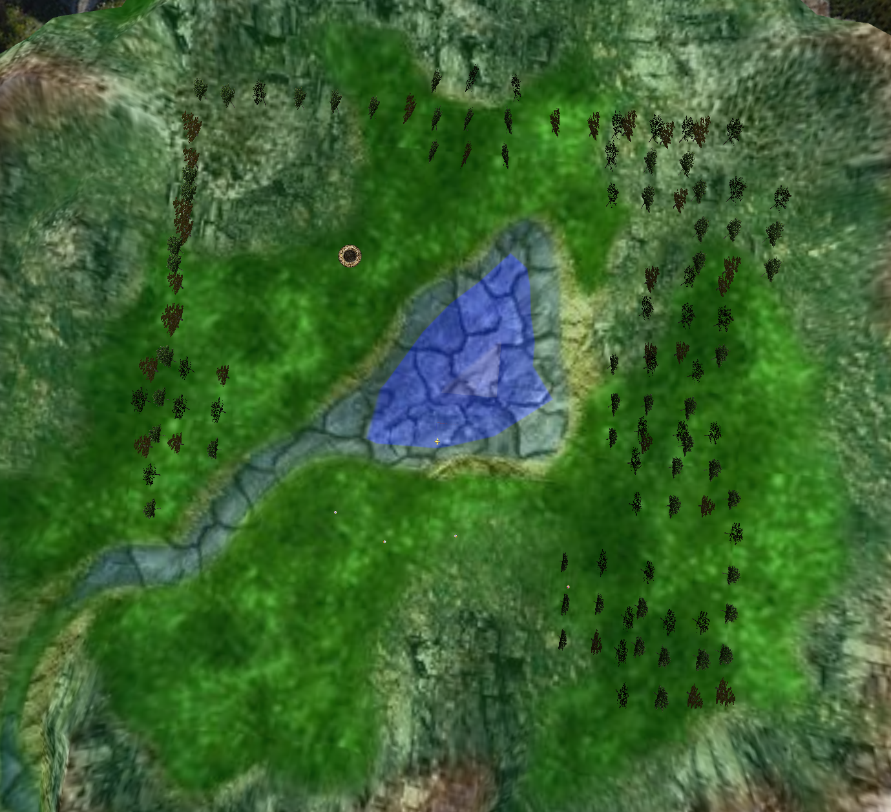

# CG Project - Group g07_06

## Group Members
- Ana Rita Oliveira (up202004155)
- Ana Beatriz Fontão (up202003574)

## Observations

### Panoram
- We added a bool parameter called isPanoram to the sphere constructor that when true inverts the order the vertices are called in the indexes and inverts the normal vectors
- Here are some angles of the panoram:

### Bird
- Our bird is constituted by ellipsoids, spheres and cones.
- The only textures we applied was to the cone to form a birthday hat and to the eyes.

### Terrain
- For the terrain, we used the texture provided along with the height map and altimetry scale.
- We created a shader that alters the height and color of the plane. The main difficulty we faced in this step was to figure out how to pass the height attribute from the .vert file to the .frag file in order to place the altimetry's respective color.
- As seen in the images below, the terrain was positioned at the base of the sphere.

### Eggs and Nest
- Our nest is composed by 2 torus: one to form the nest and another flat one on the bottom.
- We decided to also alter the scale of the eggs and nest with the scale factor so it would stay similar to the bird.
- The eggs already have predefined positions in the nest that also change based on the scale.
- The main difficulty we face in this step was how to make the egg fall in a parabolic trajectory.

### Trees
- We created our own rotate for the TreeRowPatch so that if we rotated them, the billboard positions would also change.
- We created a class MyForest that contains all the displays of TreeRowPatch and TreeGroupPatch to not overload the scene with displays.

