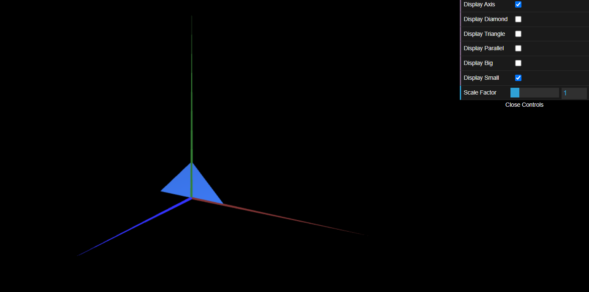
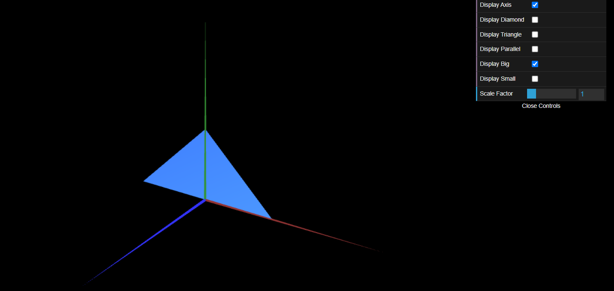

# CG 2022/2023

## Group T07G06

## TP 1 Notes

- In exercise 1, we observed that we need to put the conditions to draw the objects after ```this.setDefaultAppearance()``` or the color of the objects would be the same as the last drawn axis (green), instead of the supposed blue
- In exercise 1, to draw the parallelogram, we need to draw four triangles, two for each side (counter-clock and clockwise), in order to be able to see the object from both sides
- In exercise 2, since we already completed exercise 1, we just had to apply the same techniques to obtain both triangles. For this reason, the exercise was quite simple



