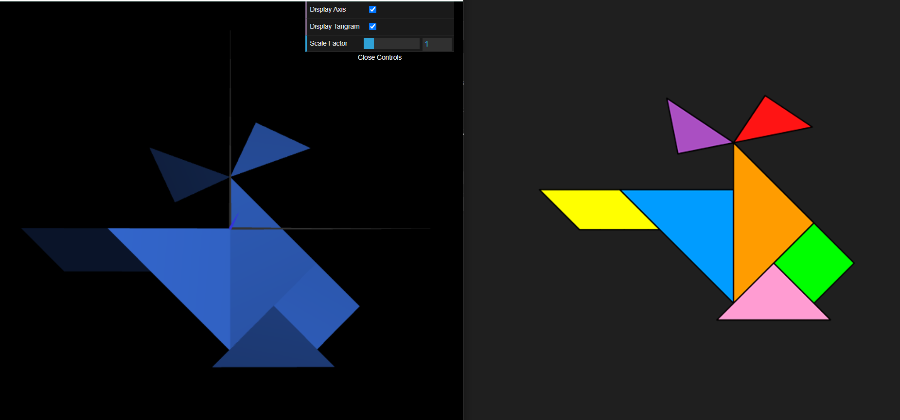
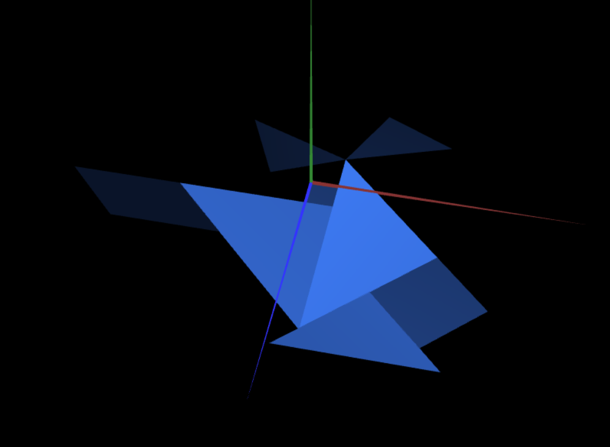
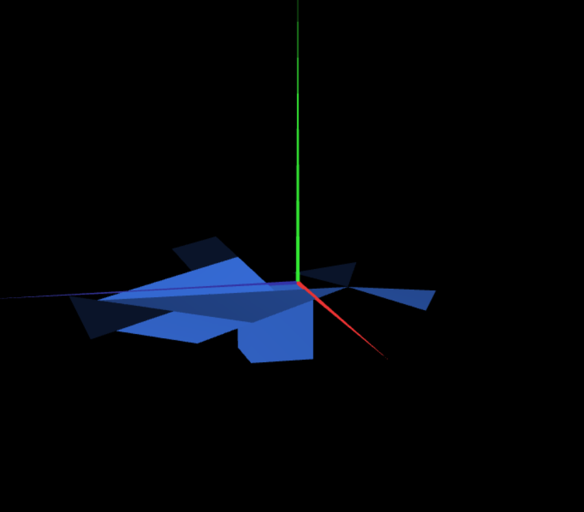
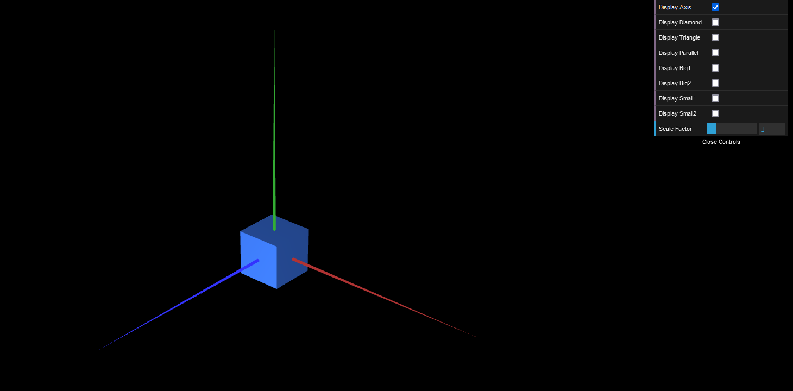

# CG 2022/2023

## Group T07G06

## TP 2 Notes

- In exercise 1, we created geometric transformations for the objects made in tp1 using matrix multiplication and CGFscene instructions. Overall, we didn't face any difficulties during this exercise.

- In exercise 2, we had to keep in mind of the order we drew the triangles, so that the visible side was facing the outside of the cube instead of the inside. If we got the order wrong, we wouldn't be able to see the faces of the triangle.

- In exercise 3, we created two new classes: MyQuad and MyUnitCubeQuad. This last one is contains an object from MyQuad class and a display function where we create a cube. The main challenge we faced during this exercise was figuring out how to display each quad so that we could see the cube from every angle (applying rotations). 

