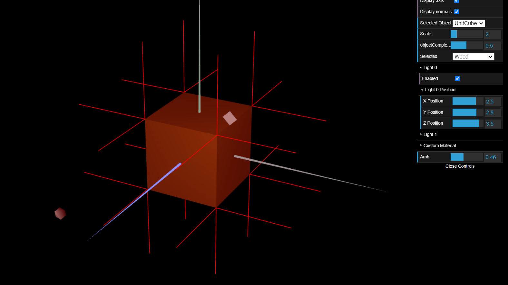
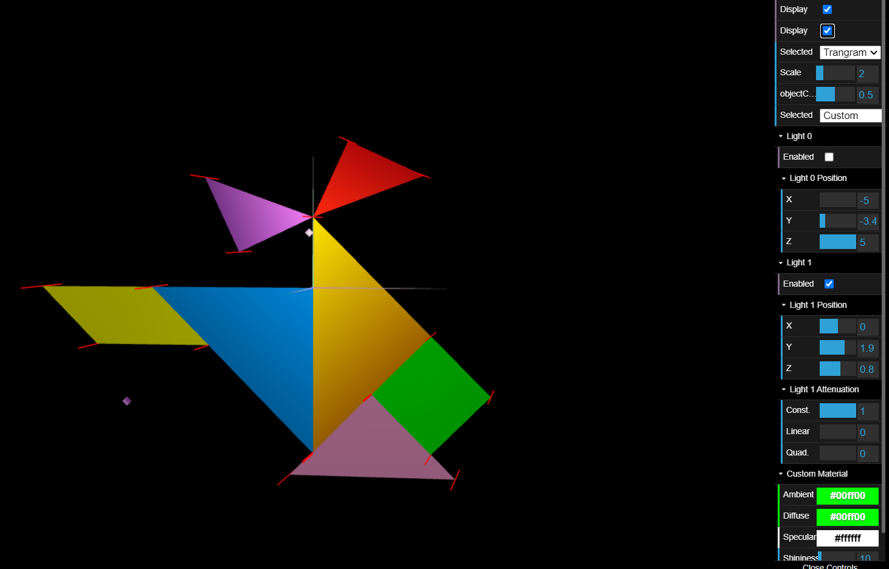
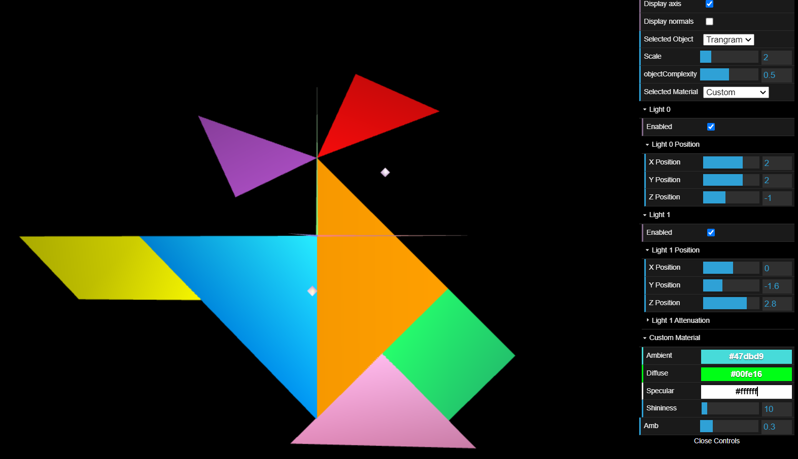
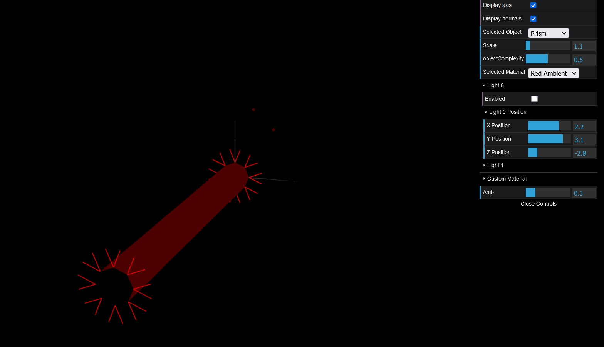
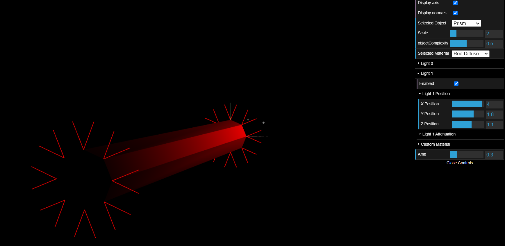
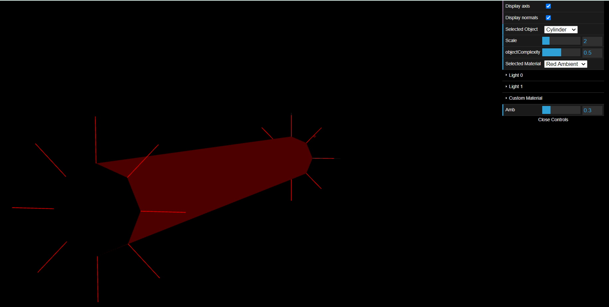
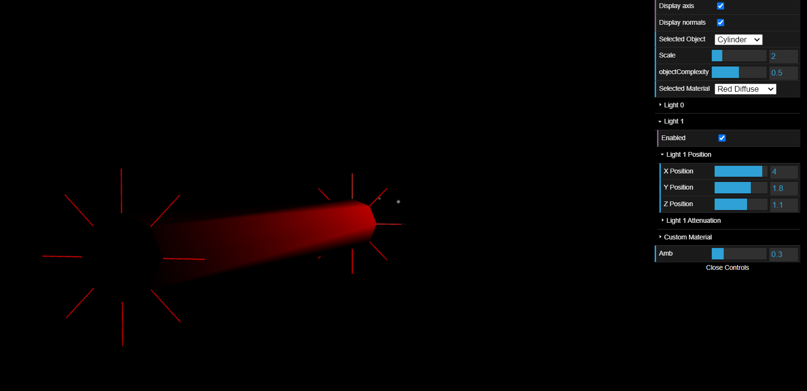

# CG 2022/2023

## Group T07G06

## TP 3 Notes

### Part 1

- In exercises 1 and 2, we could observe that despite the light being directly in front of the objects, the light was not being reflected in a natural and expected way. As mentioned in the exercise, this was due to the normal vectors of the objects not being declared.

- In exercise 3, we declared all the normal vectors of each object, keeping in mind that they should have norm equal to 1. To declare the normal vectors for both sides of a vertex, we had to write the vertices twice for each vertex of the tangram and three times for each vertex if the cube. To be able to see the normal vectors of the tangram, we also had to create two functions that enable and disabled this view.

- In exercise 4, we did as suggested and followed the example of the 'Red Diffuse' material but with a brown color.

- In exercise 5, we just had to follow what we did for exercise 4, but now with high specular component and the colors each piece.

- In exercise 6, since the diamond was the first one to be drawn we just commented the line where we applied the green material. This allowed us to freely change the color of the diamond as seen bellow.

## Part 2

- In this section, we were asked to create a prism that takes two arguments: the number of sides(slices) and height(stacks). Initially we implemented its constructor for a fixed height of 1 and then modified it to accept various heights.
- The main difficulty we faced during the execution of these exercises was understanding how to obtain each side's normals. Each vertex is defined two times so that it has two different normal associated to it (for each side). We ended up calculating them using the middle point if each side. This point can be obtain with the average value between the two vertices at the prism's base(XY).

## Part 3

- In exercise 10 and 11, we change the way we were declaring the vertices, and just declared two vertices per slice so that we wouldn't have repeated vertices. We also simply used a vertex to calculate the normal vector like it was shown in figure 3.

- In exercises 12 and 13, we can clearly see the difference the way the normal vectors are used by comparing the previous example with the one bellow. With just ambient light, it won't make a difference, but with other types of light, the prism looks more like a cylinder.

