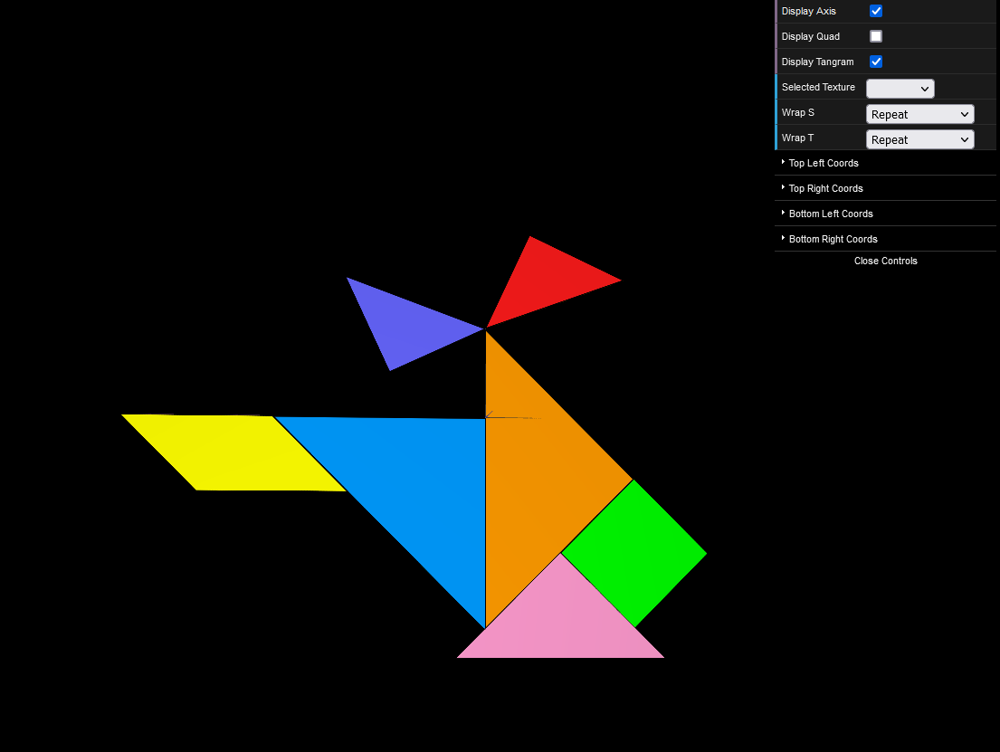
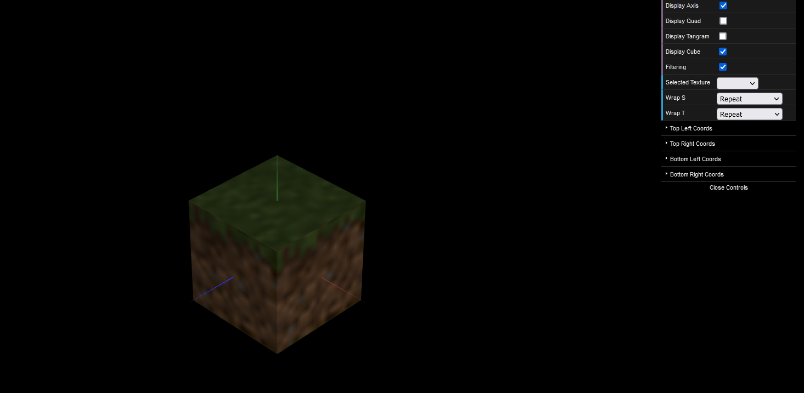
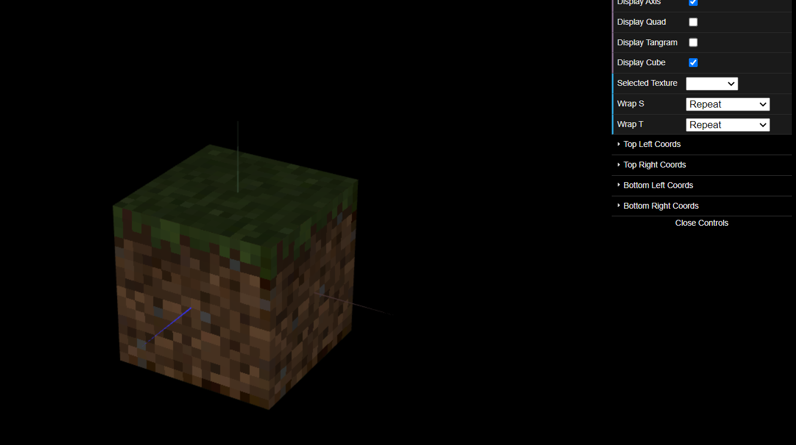

# CG 2022/2023

## Group T07G06

## TP 4 Notes

- In the first exercise, we used the knowledge accquired in the experiments and specified the texCoords for each figure of the tangram.
- We had to have some care for the big and small triangles since the tangram had two of each. Our solution for this problem was to add a parameter to the _initBuffer()_ method that specified the color and according to the color we specified different texCoords. 

- In this next exercise we added the parameters for the faces of the cube and created a texture for each face later applied it. Simply doing this resulted in the cube have a blurry look. 

- As said in the lab, this was due to linear filtering. By adding the line provided in the code that activates a different type of filtering (after activating the texture and before drawing corresponding face), we obtained the figure bellow.

