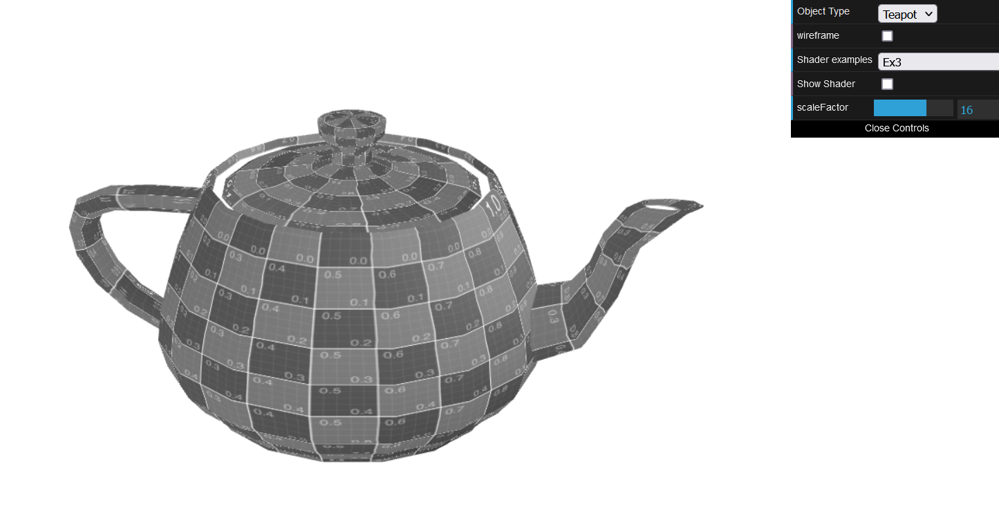

# CG 2022/2023

## Group T07G06

## TP 5 Notes

- To create the half split that depends on the position of the object, we did something similar to ```varying.frag``` and using different colors. We also did something similar to ```varying.vert``` in ```ex1.vert```, but instead of ```coords = vertex*10.0```, we used ```coords=gl_Position``` so that the colors of the teapot would depend on the position of its fragments in the window.


- For the grayscale exercise, we used a similar approach to the sepia shader, but now the color would be the grayscale formula ```L = 0.299R + 0.587G + 0.114B``` and this color would be applied to the three RGB components



-In this last execise, we mainly used what we learned from the previous exercises.
- We used ```texture2.vert``` and ```texture.frag``` and replaced the in-scene textures to be able to see the water texture with dark red spots on the plane
- Then, we changed the ```water.vert``` to create an offset that depends on the texture
- Lastly, we changed both components of ```aTextureCoord``` like isuggested on the lab guide to obtain the final result


